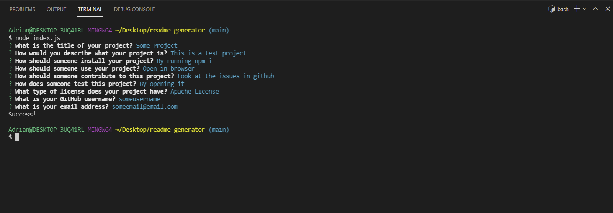
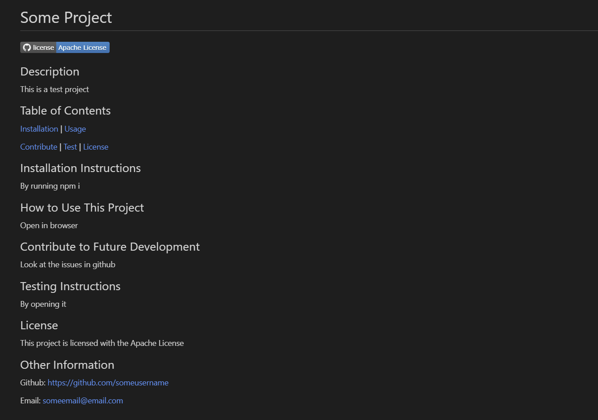

# README Generator

## Description

This is a NodeJS app that allows a user to automatically generate a README.

## Table of Contents

[Installation](#install) | [Usage](#usage)

[Contribute](#contribute) | [Test](#test) | [License](#license)

## Installation Instructions

After cloning the repo, all that needs to be done is to rum "npm i" to install the required dependencies

## How to Use This Project

After installing the required packages, you can run "node index.js" to start the app. Then answer the prompts as they appear in the terminal

## Contribute to Future Development

This project can be contributed to by creating more options for subsections that are not currently present.

## Testing Instructions

## License

This project is licensed with the Mozilla Public License

## Other Information

Github: https://github.com/amata7

Email: mata-adrian@outlook.com
